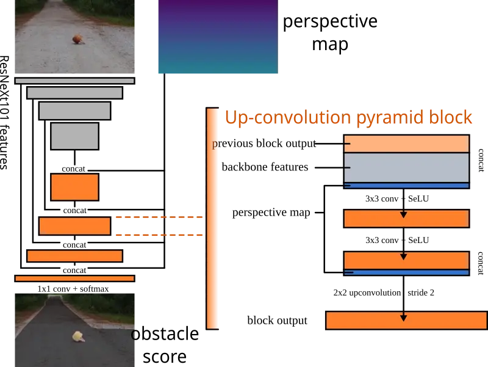

# Perspective Aware Road Obstacle Detection

[**Krzysztof Lis**](https://www.linkedin.com/in/krzysztof-lis-504b53195/), [**Sina Honari**](https://www.linkedin.com/in/sinahonari/), **Pascal Fua**, **Mathieu Salzmann**  

IEEE Robotics and Automation Letters 2023 / IROS 2023

[Paper](https://infoscience.epfl.ch/record/301426/files/PerspectiveAwareRoadObstacleDetection.pdf)  
[Poster](doc/PerspectiveAwareRoadObstacleDetection_poster.pdf)  

`lis.krzysztof@protonmail.com` `sina.honari@gmail.com` `pascal.fua@epfl.ch` `mathieu.salzmann@epfl.ch`

<!--   -->
<!-- side by side: -->
 

## Task: Detecting unusual obstacles on the road

We detect arbitrary obstacles located on the road surface. The obstacle types are not present in our training set (Cityscapes).
We test with the **Segment Me If You Can** benchmark's **Obstacle Track**.

<https://segmentmeifyoucan.com/>

